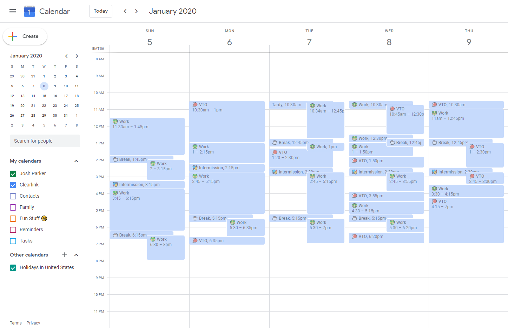

# wfm-gcal-sync
quick and dirty bot that syncs NICE data with Google Calendar

This project no longer functions as authentication has been changed to SAML.

I wanted to create a bot that would automatically scan my schedule and sync it with google calendar
so I did exactly that. It involves some web scraping and custom APIs to pull relevant data from
the server side rendered pages since the service lacks any APIs.

